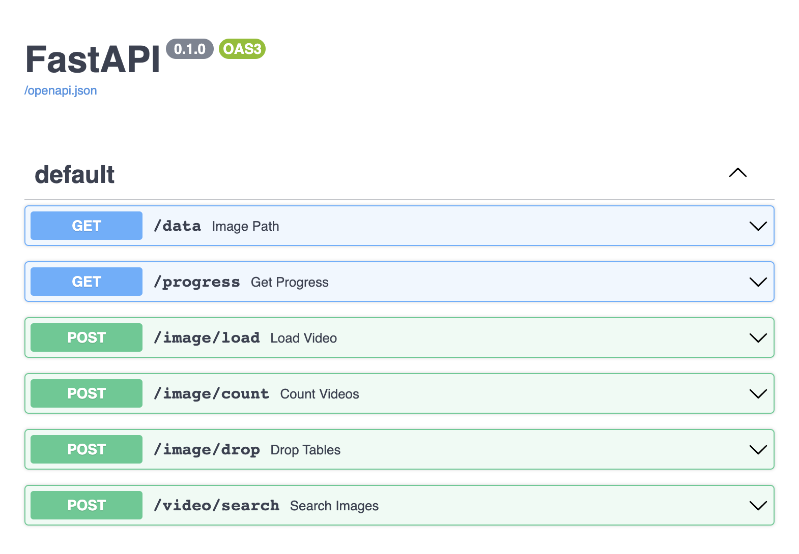

# Video Object Dection System

## Overview

This demo uses **Milvus** to detect objects in a video based on a dataset of object images with known information. To get images of objects in videos, it uses OpenCV to extract video frames and then uses Yolov3 to detect objects in each frame. It uses ResNet50 to get feature vectors of images for both known objects in dataset and objects detected in video. Finally, it can detect object and get object information easily by similarity search in Milvus. Let's have fun playing with it!


## How to deploy the system

### 1. Start Milvus and MySQL

The video object detection system will use Milvus to store and search the feature vector data. Mysql is used to store the correspondence between the ids returned by Milvus and the object information (name & image path). So you need to start Milvus and Mysql first.

- **Start Milvus v2.0**

  First, you are supposed to refer to the Install [Milvus v2.0](https://milvus.io/docs/v2.0.0/install_standalone-docker.md) for how to run Milvus docker.
  
  > Note the version of Milvus.
  
- **Start MySQL**

  ```bash
  $ docker run -p 3306:3306 -e MYSQL_ROOT_PASSWORD=123456 -d mysql:5.7
  ```

### 2. Start Server
The next step is to start the system server. It provides HTTP backend services, you can run source code to start.

#### 2.1 Run source code
- **Install the Python packages**

  ```bash
  $ cd server
  $ pip install -r requirements.txt
  ```
  
- **Set configuration**

  ```bash
  $ vim server/src/config.py
  ```

  Please modify the parameters according to your own environment. Here listing some parameters that need to be set, for more information please refer to [config.py](./server/src/config.py).

  | **Parameter**    | **Description**                                       | **Default setting** |
  | ---------------- | ----------------------------------------------------- | ------------------- |
  | MILVUS_HOST      | The IP address of Milvus, you can get it by ifconfig. | localhost           |
  | MILVUS_PORT      | Port of Milvus.                                       | 19530               |
  | VECTOR_DIMENSION | Dimension of the vectors.                             | 2048                |
  | MYSQL_HOST       | The IP address of Mysql.                              | localhost           |
  | MYSQL_PORT       | Port of Milvus.                                       | 3306                |
  | DEFAULT_TABLE    | The milvus and mysql default collection name.         | video_obj_det       |
  | DATA_PATH        | The folder path of known object images to insert.     | data/example_object |
  | UPLOAD_PATH      | The folder path of the video and will temporarily keep frames & object images from video. | data/example_video |
  | DISTANCE_LIMIT   | Maximum distance to return object information. If no result with smaller distance, then return Null as object information. | None |

- **Run the code** 

  Then start the server with Fastapi. 

  ```bash
  $ cd src
  $ python main.py
  ```

- **The API docs**

  Type localhost:5000/docs in your browser to see all the APIs.

  

  > /data
  >
  > Return the object images.
  >
  > /progress
  >
  > Check the progress when loading.
  >
  > /image/count
  >
  > Return the number of vectors in Milvus.
  > 
  > /image/load
  >
  > Load images of known objects under the specified directory.
  >
  >
  > /video/search
  >
  > Pass in an video to search for similar images of objects detected.
  
- **Fastapi examples**
  - /image/load
  
  
  
  - /video/search
  
  
  

- **Code structure**

  If you are interested in our code or would like to contribute code, feel free to learn more about our code structure.

  ```
  └───server
  │   │   Dockerfile
  │   │   requirements.txt
  │   │   main.py  # File for starting the program.
  │   │
  │   └───src
  │       │   config.py   # Configuration file.
  │       │   encode.py   # Covert image/video/questions/... to embeddings.
  │       │   milvus_helpers.py   # Connect to Milvus server and insert/drop/query vectors in Milvus.
  │       │   mysql_helpers.py    # Connect to MySQL server, and add/delete/query IDs and object information.
  │       │   
  │       └───operations    # Call methods in milvus_helpers.py and mysql_helperes.py to insert/search/delete objects.
  │               │   insert.py
  │               │   search.py
  │               │   delete.py
  │               │   count.py
  ```
